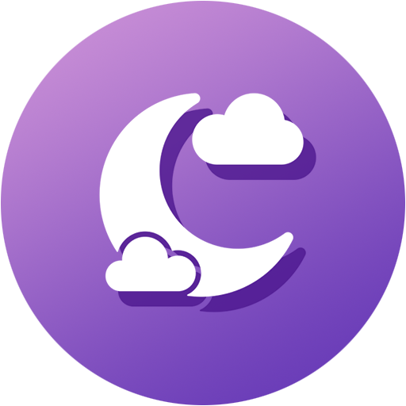

# SleepRecorder Privacy Policy

SleepRecorder is an Android app developed by the [Affective Computing Group](https://www.media.mit.edu/groups/affective-computing/overview/) at the [MIT Media Lab](https://www.media.mit.edu/). It is a research application designed to gather data from study participants. If you are not a participant in one of our research studies, this app is not intended to be used by you.

The primary purpose of the SleepRecorder app is to collect sleep and location data for use in our scientific studies. As such, the app will only function if you give it permission to access your sleep data in Google Healthkit and access to your location while the app is running. The app will spawn a service that will run in your notifications tray that will periodically get your latest location and sleep data and upload them to our cloud server. The system is designed to get data frequently enough for our study while respecting the battery life of your phone.

## Collected Data

When you first start SleepRecorder, it will prompt you for your Participant ID. This is an anonymous identifier that your study coordinator should have provided you. The app uses your Participant ID as your only identifier, and ties all your data to that one ID. It does not track any information about who you are or which phone you’re using.

We are well aware that location data is very sensitive and can be used to identify people. As such, all location data is encrypted via [RSA-4096 encryption](https://en.wikipedia.org/wiki/RSA_(cryptosystem)) before being uploaded to our server. Your sleep data is not identifying (nobody can figure out who you are because you went to bed at 10pm last night, since millions of people did too!), it is not encrypted.

All data collected by the app is uploaded to our secure [Firebase Firestore](https://firebase.google.com/docs/firestore) database where it is only associated with your Participant ID, which is an anonymous identifier assigned by us. From there, it is downloaded by our team onto our secured research computers, where it is decrypted using our secure private decryption keys and used for study analysis.

## Third Party Sharing

We do not share your data with third parties, with the only exception being to publish aggregated and anonymized data in academic articles. After all, publishing papers is the point of the study and the app itself. All data collected is to remain internal and can only be accessed by personnel identified in the IRB study protocol. We reserve the right to publish academic articles on aggregated and anonymized data as pertains to your study agreements, but outside of that we will keep your data safe.

If you use the app and are somehow not enrolled in one of our studies, we will not share your data with anyone nor will we publish on it.

We will obviously not share your data with any advertising platforms, data brokers, or information resellers. Ever. For any reason.

## Opt Out

Since this app is designed to be used only by our study participants, there is no data opt out, though the data gathering service can be disabled from within the app. If you wish to uninstall or stop using the app’s data gathering service, please contact your study coordinator first.

## Deleting Your Data

If you have enrolled in one of our studies and wish for us to delete your data collected for the study, please contact your study coordinator. This helps your coordinator keep your identity and data anonymous and ensures that all your data is disposed of properly across all platforms that may be used in your study. If for some reason you cannot contact your study coordinator and want to request your data be deleted, please email us at [affective-apps@media.mit.edu](mailto:affective-apps@media.mit.edu). However, this should be your last resort, since your study coordinator should be your primary contact with our team. (We respect your privacy and try to keep your information and identity as secret as possible within our team itself!)

If you are somehow using the app and have not enrolled in one of our studies, please contact us at [affective-apps@media.mit.edu](mailto:affective-apps@media.mit.edu) and provide your participant ID you’re using for the app, and we will happily delete all your data that has been stored by SleepRecorder. It shouldn’t be in our database anyway!

## Contact Us

If you have any questions, please reach out to your study coordinator so they can maintain your anonymity. If you are not part of a study and need to reach us, we can be contacted at [affective-apps@media.mit.edu](mailto:affective-apps@media.mit.edu).

