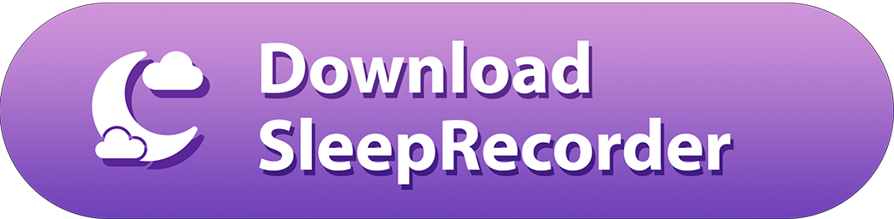
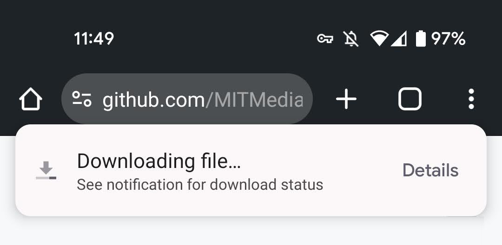
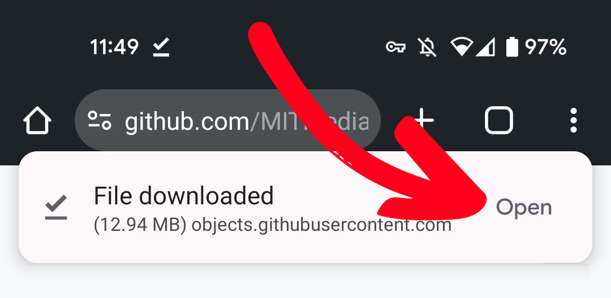
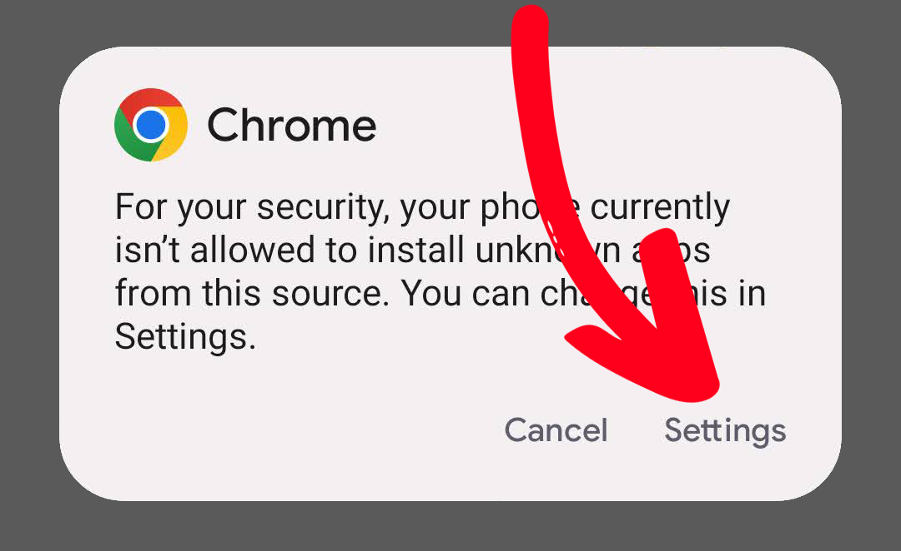
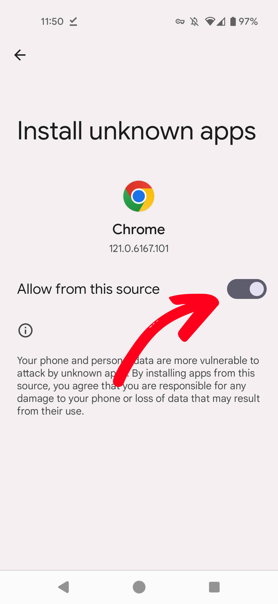

<h1 align="center">SleepRecorder Download Instructions</h1>

# Quick Installation

---

**1.** Click the following button on your phone to download the SleepRecorder APK.

**2.** Chrome will open a download dialog

**3.** When the download is complete, click "Open"

**4.** This will probably open a security dialog. Click "Settings"

**5.** You will be brought to the Settings screen to allow Chrome to install unknown apps. This setting allows Chrome to our app installer (APK file). Click the toggle to allow installation of the SleepRecorder APK.

**6.** SleepRecorder should automatically be installed, and ready for you to use! 🎉

**7.** *(Optional)* You may wish to reset the security permissions to disallow Chrome to install unknown apps. If so, follow the instructions below, and click the permission off.

## Detailed Instructions

---

If the above process did not work for you, here are more detailed instructions how to enable installing the SleepRecorder APK.

## Android 8 or above

### Samsung devices

  
Expand to read instructions

<ul>
<li> On your device, tap Settings > Apps.</li>
<li> At the top-right, tap Vertical ellipsis..</li>
<li> Tap Special access > Install unknown apps.</li>
<li> Tap the browser from where you will download the APK, such as Chrome.</li>
<li> If prompted, toggle Allow from this source on.</li>
</ul>

### Non-Samsung devices

  
Expand to read instructions

<ul>
<li> On your device, go to Settings.</li>
<li> Tap Apps.</li>
<li> Tap Special app access.</li>
<li> Tap the browser from where you will download the APK, such as Chrome.</li>
<li> If prompted, toggle Allow from this source on.</li>
</ul>

## Android 7 or below

  
Expand to read instructions

<ul>
<li> On your device, tap Settings.</li>
<li> Tap Security.</li>
<li> Under Device administration, toggle Unknown sources on.</li>
</ul>

 

